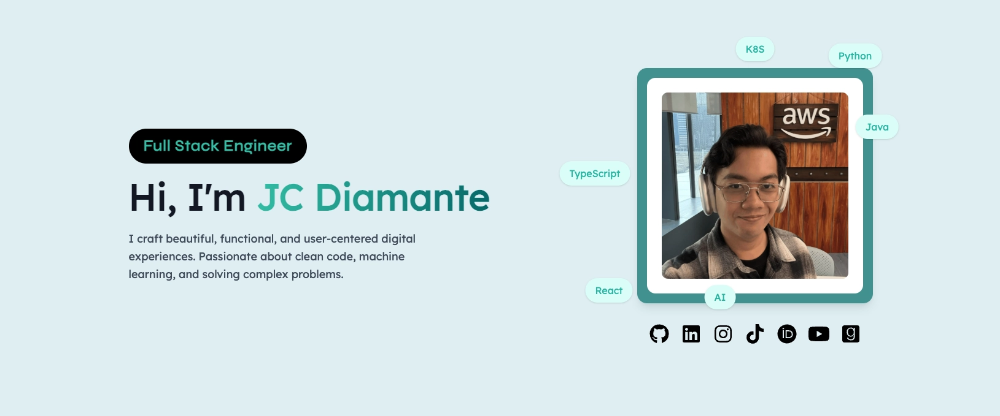
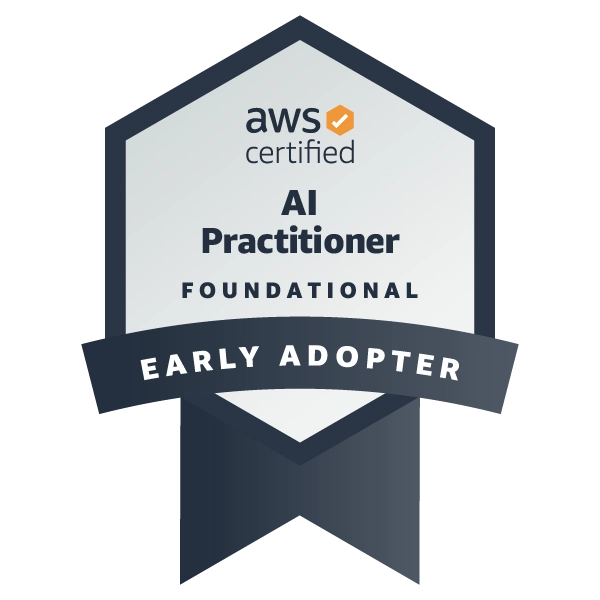

<!--  -->

<!-- <h1 align="center">Hi 👋, I'm JC Diamante</h1> -->
<h2 align="center">JC Diamante | Zeraphim</h1>
<h3 align="center">Full Stack Software Engineer</h3>

I'm JC, a Software Engineer at GCash where I build backend microservices serving 94 million users. I'm also a Research Scientist working on forest fire detection using AI, and I'm pursuing my Master's in AI at UT Austin. I've published in IEEE and ACM, won multiple hackathons including NASA Space Apps, and I'm 5x AWS certified. Whether it's a production-ready backend or a machine learning model, I build things that work.

  

<!-- 
  
 -->

- 🔭 I’m currently working on **Data Science Projects/Research**

- 🌱 I’m currently taking **Masters in AI** at UT Austin 🤘🏼

- 💬 Ask me about **Data Science, AI/ML, React, NextJS**

- 📫 How to reach me **jdmntec@gmail.com**

- ⚡ Fun fact **I play kalimba**

<h3 align="left">Connect with me:</h3>

  

  <h3>🛠️ Tech Stack 🛠️</h3>

<!-- 

  

  <h3 align="center">⭐️ Certifications / Badges ⭐️</h3>

  

    
    
    
    
    
    
    
    
    
    
  

 -->

<!-- 
 -->

<!-- 
 -->
<!-- <h3>📊 GitHub Stats 📊</h3> -->

<!--  -->
<!--  -->
<!--  -->

<!-- 

  

    

      
    

    

      
    

  

  
  

    
  

 -->
<!-- 
 -->

</td>
<td>
