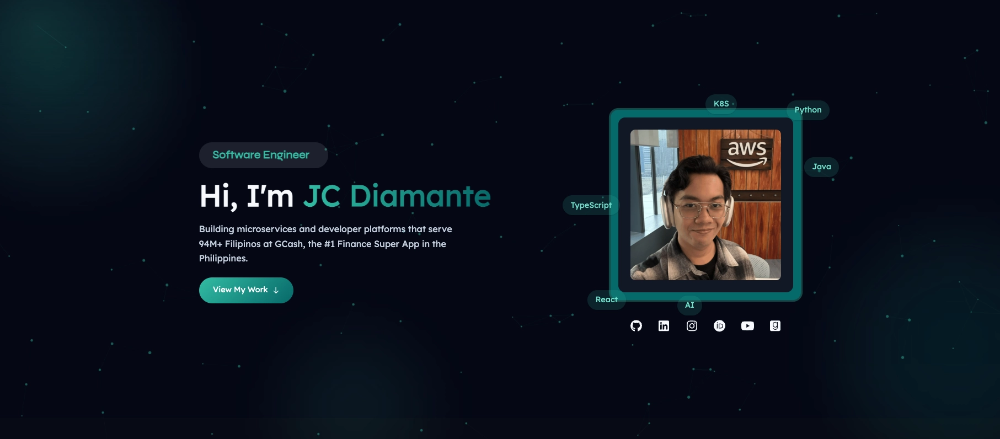

<h1 align="center">Hi, I'm JC 👋🏼 &nbsp;◆</h1>

  <b>I build software, research AI, and teach both.</b> 
  Lead Software Engineer <a href="https://gcash.com/">@GCash</a> (backend for 94M+ users) ·
  AI Research Scientist <a href="https://www.mapua.edu.ph/">@Mapúa</a> ·
  MS in AI <a href="https://www.utexas.edu/">@UT&nbsp;Austin</a>

  
  
  
  

---

I'm a builder who never really picked one lane — and stopped apologizing for it. Days I'm shipping backend microservices that keep money moving for **94M+ users** at GCash. Other days I'm training vision models to spot wildfires from the air, or in class for my **Master's in AI at UT Austin**. And I genuinely love teaching the stuff once it clicks. Big fan of hackathons, automating anything I'm too lazy to do twice, and the occasional kalimba break. 🎶

My whole thing is **passion & excellence** — whether it's a production system or a research paper, I want it to actually *work*.

## 🧭 What I do

<table>
<tr>
<td width="33%" valign="top">

### 🛠️ Build
Backend & platform engineering at scale — Java/Spring Boot, Python/FastAPI, Kafka, Redis, Docker, Kubernetes, CI/CD. Systems that don't fall over.

</td>
<td width="33%" valign="top">

### 🔬 Research
Computer vision & ML — **IEEE + ACM published**. YOLOv12 wildfire detection at **93.1% mAP@50**, real-time on the edge.

</td>
<td width="33%" valign="top">

### 📚 Teach
Ex-university instructor, open-source contributor, and mentor. I break AI/ML down into plain English and share what I learn.

</td>
</tr>
</table>

## 📊 A few numbers

- 🏦 Backend for **94M+ users** in FinTech at GCash
- 🔥 **93.1% mAP@50** wildfire detection (YOLOv12, 33ms inference) — with ASU & Cintana Alliance
- 📄 **2 peer-reviewed papers** (IEEE I2CACIS, ACM CIIS) → [ORCID](https://orcid.org/0009-0002-6594-956X)
- ☁️ **5× AWS** certified + Azure Developer Associate
- 🤖 Ranked **#1 of 429 developers** in AI-assisted dev adoption at GCash
- 🏆 NASA Space Apps global nominee · multiple hackathon wins · Magna Cum Laude

## 🧰 Tech I reach for

## 🚀 Featured work

**Open source & public**

- **[bettergovph/bettergov](https://github.com/bettergovph/bettergov)** — Contributor to the Philippines' civic-tech platform (486★). Fixed map rendering, search pagination, and multilingual responsive nav. `React · TypeScript · Meilisearch · Cloudflare`
- **[ScholarSprint](https://github.com/Zeraphim/ScholarSprint)** — Interactive research workflow: ingest arXiv papers, retrieve, and generate structured LLM summaries. `Python · Streamlit · Pydantic-AI`
- **[streamlit-dashboard-template](https://github.com/Zeraphim/streamlit-dashboard-template)** — Teaching template I built for my Intro to Data Science students. `Python · Streamlit`
- **[Streamlit Iris Classification Dashboard](https://github.com/Zeraphim/Streamlit-Iris-Classification-Dashboard)** — End-to-end EDA → preprocessing → supervised ML teaching demo. `Python`

**Selected private / company work** *(code not public — happy to talk through it)*

- **GPlayground** — AI-powered onboarding platform (Vertex AI, MongoDB); **1st runner-up, GCash PSD Hackathon 2025**, funded into an MVP. `React · TypeScript · Vertex AI`
- **Wan Shi Tong** — Agentic workflow that catches cross-project breaking changes in merge requests before they merge. *GitLab AI Hackathon 2026.* `Python · FastAPI · Multi-agent`
- **GCash platform engineering** — 30+ microservices on Kubernetes, Backstage developer-portal plugins, GitOps pipelines — 90%+ test coverage, zero deploy reverts.

## 🔬 Research & publications

I work on applied computer vision and ML. Full list on my **[ORCID profile](https://orcid.org/0009-0002-6594-956X)**.

- *Classification of Philippine Soybean Variety Using Image Processing and Machine Learning* — **IEEE I2CACIS 2024**
- *Detection of Water Hyacinth on the Pasig River via YOLOv7* — **ACM CIIS 2023**

## ✍️ I also write & share

  
  
  

**Featured writings**

- **[Can't Use Cloud AI on Patient Data? — ICU Mortality Predictor with Local LLMs](https://www.jcdiamante.com/blog/cant-use-cloud-ai-patient-data-local-llms-icu-mortality)** — Running Gemma 4 & Qwen3 Coder on-device with MIMIC-III clinical data for my UT Austin AI in Healthcare course. `Local AI · Healthcare AI · Machine Learning`
- **[Running Local LLMs With LM Studio](https://www.jcdiamante.com/blog/running-local-llms-lm-studio-small-models)** — Testing small models for real tasks (Filipino privacy-law assistant) and learning what local AI can actually deliver today. `Local AI · Machine Learning`
- **[I Bought a Raspberry Pi Because AWS Humbled Me](https://www.jcdiamante.com/blog/i-bought-a-raspberry-pi)** — After one too many idle EC2 bills, I bought a Pi and let it do the quiet work on my desk. `Cloud & Infra · Hardware`

<!--## 📈 GitHub stats

  
  

-->

---

  <i>◆ Passion &amp; Excellence — build things that work, research things that matter, teach so others can do both.</i> 
  📫 <a href="mailto:jdmntec@gmail.com">jdmntec@gmail.com</a> · 🌐 <a href="https://jcdiamante.com">jcdiamante.com</a>

