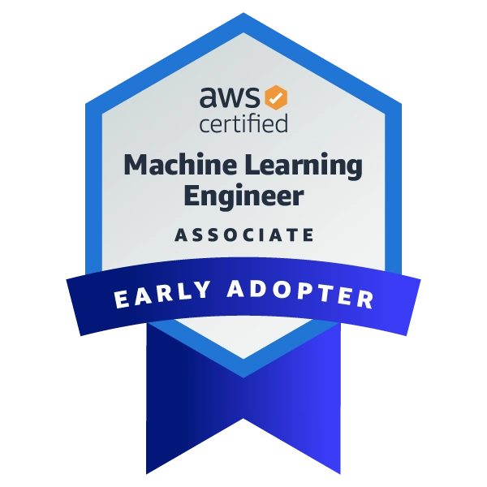
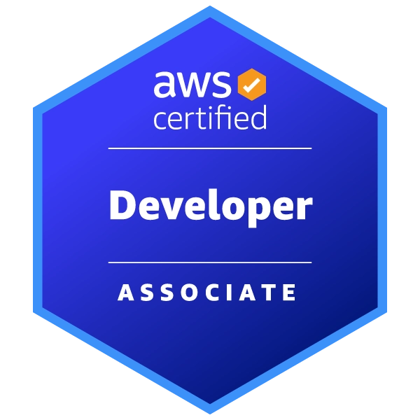
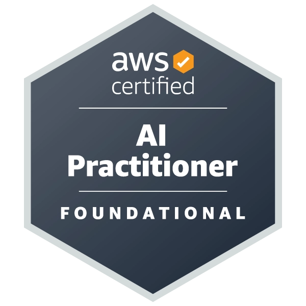
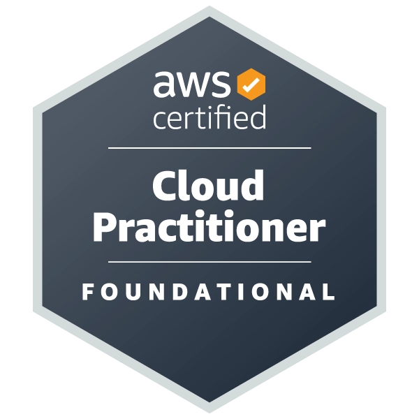

<!--  -->

<!-- <h1 align="center">Hi 👋, I'm JC Diamante</h1> -->
<h2 align="center">JC Diamante | Zeraphim</h1>
<h3 align="center">Data Scientist and Software Engineer</h3>

I am deeply passionate about continuous learning and personal growth. My academic and professional journey has been driven by unyielding curiosity and commitment to mastering new skills. Dedicated in making substantial contributions to the dynamic field of data science and software development.

  

<!-- 
  
 -->

- 🔭 I’m currently working on **Data Science Projects/Research**

- 🌱 I’m currently learning **AWS**

- 💬 Ask me about **Data Science, AI/ML, React**

- 📫 How to reach me **jdmntec@gmail.com**

- ⚡ Fun fact **I play kalimba**

<h3 align="left">Connect with me:</h3>

  

  <h3>🛠️ Tech Stack 🛠️</h3>

 

  

<h3 align="center">⭐️ Certifications / Badges ⭐️</h3>

<h3>📊 GitHub Stats 📊</h3>

  
   

<!--

  

-->

</td>
<td>
